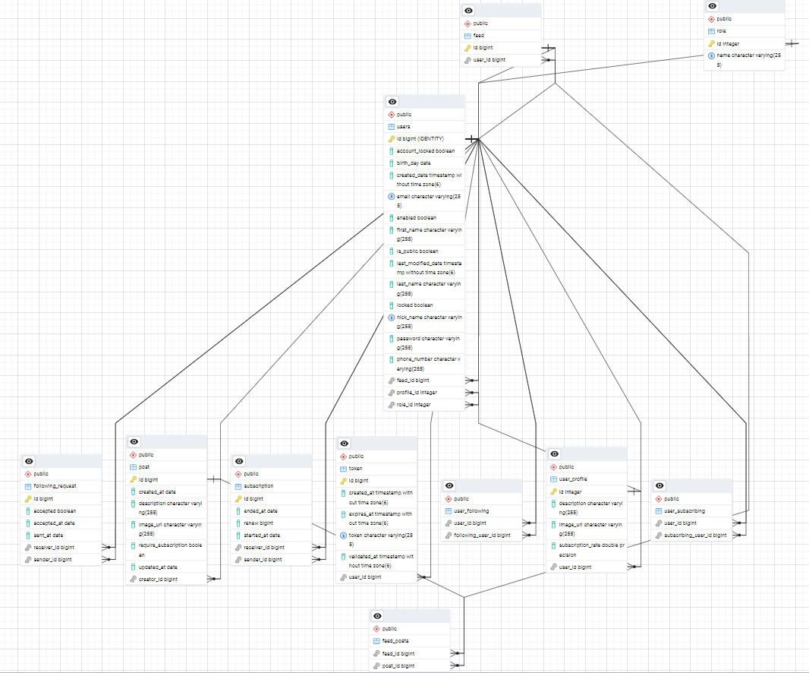

# Paradise Reflection - Backend Documentation

## Overview

Welcome to the Paradise Reflection backend repository. This application aims to help individuals reflect on what they consider the ultimate beauty, happiness, and enjoyment. By allowing users to share their thoughts through various formats—such as pictures, videos, and written content—we strive to create a platform where everyone can experience the paradise of others, fostering new forms of happiness and inspiration.

## Database Schema

This backend is built upon a relational database with the following tables:

1. **Feed**
   - **id**: Unique identifier for the feed.
   - **user_id**: Identifier for the user associated with the feed.
   - **Constraints**: 
     - Primary Key: `feed_pkey (id)`
     - Unique Key: `ukapn4i7cc5w75dr7bqo1jj1xm0 (user_id)`

2. **Feed Posts**
   - **feed_id**: Identifier for the feed.
   - **post_id**: Identifier for the post.

3. **Following Request**
   - **id**: Unique identifier for the following request.
   - **accepted**: Indicates whether the request has been accepted.
   - **accepted_at**: Date when the request was accepted.
   - **sent_at**: Date when the request was sent.
   - **receiver_id**: Identifier for the user receiving the request.
   - **sender_id**: Identifier for the user sending the request.
   - **Constraints**: Primary Key: `following_request_pkey (id)`

4. **Post**
   - **id**: Unique identifier for the post.
   - **created_at**: Date the post was created.
   - **description**: Description of the post.
   - **image_url**: URL of the post's image.
   - **require_subscription**: Indicates if the post requires a subscription.
   - **updated_at**: Date the post was last updated.
   - **creator_id**: Identifier for the user who created the post.
   - **Constraints**: Primary Key: `post_pkey (id)`

5. **Role**
   - **id**: Unique identifier for the role.
   - **name**: Name of the role.
   - **Constraints**: Primary Key: `role_pkey (id)`

6. **Subscription**
   - **id**: Unique identifier for the subscription.
   - **ended_at**: Date the subscription ended.
   - **renew**: Renewal information.
   - **started_at**: Date the subscription started.
   - **receiver_id**: Identifier for the user receiving the subscription.
   - **sender_id**: Identifier for the user sending the subscription.
   - **Constraints**: Primary Key: `subscription_pkey (id)`

7. **Token**
   - **id**: Unique identifier for the token.
   - **created_at**: Date the token was created.
   - **expires_at**: Expiration date of the token.
   - **token**: The actual token string.
   - **validated_at**: Date the token was validated.
   - **user_id**: Identifier for the user associated with the token.
   - **Constraints**: Primary Key: `token_pkey (id)`

8. **User Following**
   - **user_id**: Identifier for the user.
   - **following_user_id**: Identifier for the user being followed.

9. **User Profile**
   - **id**: Unique identifier for the user profile.
   - **description**: Description of the user profile.
   - **image_url**: URL of the user's profile image.
   - **subscription_rate**: Subscription rate of the user.
   - **user_id**: Identifier for the associated user.
   - **Constraints**: Primary Key: `user_profile_pkey (id)`

10. **User Subscribing**
    - **user_id**: Identifier for the user.
    - **subscribing_user_id**: Identifier for the user being subscribed to.

11. **Users**
    - **id**: Unique identifier for the user.
    - **account_locked**: Indicates if the account is locked.
    - **birth_day**: User's date of birth.
    - **created_date**: Date the user account was created.
    - **email**: User's email address.
    - **enabled**: Indicates if the user account is enabled.
    - **first_name**: User's first name.
    - **is_public**: Indicates if the user profile is public.
    - **last_modified_date**: Date the user profile was last modified.
    - **last_name**: User's last name.
    - **locked**: Indicates if the user account is locked.
    - **nick_name**: User's nickname.
    - **password**: User's password.
    - **phone_number**: User's phone number.
    - **feed_id**: Identifier for the user's feed.
    - **profile_id**: Identifier for the user's profile.
    - **role_id**: Identifier for the user's role.
    - **Constraints**: Primary Key: `users_pkey (id)`

## Entity-Relationship Diagram (ERD)

## Technology Stack

The backend is developed using **Java** and **Spring Boot**, adhering to the Model-View-Controller (MVC) architecture. Each service is organized into its own package, ensuring a modular structure for better maintainability.

To enhance performance and efficiency, the application utilizes **Kafka** for real-time updates of user feeds.

## Deployment

The application can be easily deployed using the provided Docker Compose file available in this repository. This setup allows for quick and efficient deployment of the backend services, simplifying the development and production environments.

## Bug Reporting

If you encounter any issues or bugs, please report them at the following link: [Report an Issue](https://github.com/arraymahdi/paradise-reflection.git). Please include detailed reproduction steps to help us address your concerns effectively.
